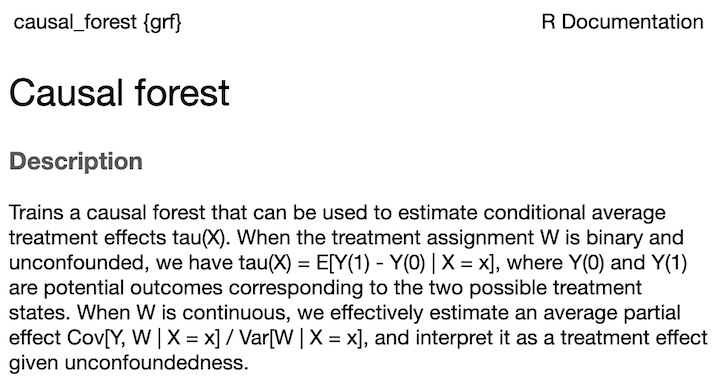

```{r setup, include=FALSE}
knitr::opts_chunk$set(echo = TRUE)
library(dplyr)
```

# Preliminaries: Analyzing Experiments

## What do I mean by "experiment"? 
- Take sample from a population of subjects
- Randomly assign subjects to either treatment or control
- Measure average outcome for each subjects
- Compare outcomes between treatment and control groups

This procedure allows you to estimate the causal effect of the **treatment** on some **outcome**

## What types of experiments have **you** worked on? 
Tell me in the chat while I tell you about my experiment.

## Rhea chicks experiment
Koch, Colleen S., et al. "Training Rhea Americana chicks to walk voluntarily across a scale; effect on the handler's time and the chicks' weight gain compared with traditional techniques: A pilot study." *Journal of Veterinary Behavior* 18 (2017): 69-75.

Protocol: 
- Newly-hatched rhea chicks were randomly assigned to be weighed by: 
  - Being scooped up in a bucket involuntarily (standard practice)
  - Being encouraged to walk onto the scale using food  
- Chicks were weighed using the assigned method at 0, 10 and 25 days after hatch  

Thanks, Mom!

## Example: Rhea chicks experiment
```{r}
chicks <- read.csv("rhea.tables.grams.20150626.csv")
chicks$treatment <- as.factor(chicks$treatment)
chicks$breeding_group <- as.factor(chicks$breeding_group)
chicks$sex <- as.factor(chicks$sex)
chicks$hatch_date <- as.Date(chicks$hatch_date, format="%m/%d")
chicks$color <- as.factor(chicks$color)
head(chicks)
```

## Chicks data summary
```{r}
summary(chicks)
```
## Are your experiments this cute? 


## How to think about an experiment
Each subject has two potential outcomes in the experiment: 
$$Y_i(1) \hspace{1in}{      } Y_i(0)$$

The individual treatment effect is the difference between these two outcomes:
$$\tau_i = Y_i(1) - Y_i(0)$$
Unfortunately, we can only observe one potential outcome for each subject, so we can never know what $\tau_i$ is for each subject 

## Average treatment effect (ATE)
Typically, the goal of an experiment is to estimate the **average treatment effect (ATE)**: 
$$\tau = \mathbb{E}_i[Y_i(1) - Y_i(0)]$$
which we estimate as the difference-in-means
$$\widehat\tau = \frac{1}{n_1}\sum_{\textrm{treated}}Y_i(1) - \frac{1}{n_0}\sum_{\textrm{control}}Y_i(0)$$
where $n_1$ and $n_0$ are the number of treated and control subjects. 

## Why experiments?
The difference-in-means $\widehat\tau$ is an unbiased estimate of the average treatment effect (ATE)

Under the assumption that the outcomes for one subject do not affect the other subjects (SUTVA)

In other words, randomization eliminates the possiblity of **confounders**

## Average Treatment effect for chicks
```{r}
chicks %>%
  group_by(treatment) %>%
  summarize(mean(grams_day25))
```

```{r}
chicks %>% 
  filter(treatment=="Voluntary Walk-On") %>% 
  summarize(mean(grams_day25)) - 
  chicks %>% 
    filter(treatment=="Involuntary Bucket") %>% 
  summarize(mean(grams_day25))
```
## Aside: Random sampling
The average treatment effect averages over the **population in the experiment**.

The ideal experiment randomly samples from the target population.

- Trivial in engineering experiments
- Do-able in marketing experiments
- Unethical in clinical trials 

So, there are two types of randomization in the ideal experiment: **random sampling** to selct subjects and **random assignment** to treatments

## Statistical analysis: t test
The goal of a statistical analysis is to quantify uncertainty. One statistical analysis used for experiments is a t test. Here we have a very wide confidence interval for the difference, so we "aren't too sure." 
```{r}
t.test(grams_day25 ~ treatment, data=chicks)
```

## Statistical analysis: regression
```{r}
m1 <- lm(grams_day25 ~ treatment, data=chicks)
summary(m1)
```
## Statistical analysis: regression
```{r}
confint(m1)
```

## Summary of preliminaries 
- Randomized experiments allow us estimate the average treatment effect (ATE) by a simple difference-in-means calculation
- We can characterize the uncertainty in our estimate using a t test or a simple regression of the outcome on the treatment

# Treatment modifiers

## Treatment modifiers
Treatment effects may be different for different groups of subjects. 
```{r}
chicks %>%
  group_by(color, treatment) %>%
  summarize(mean(grams_day25), .groups="keep")
```
## Difference-in-means for breeding groups
```{r}
chicks %>% filter(color=="b", treatment=="Voluntary Walk-On") %>% 
  summarize(mean(grams_day25)) - 
  chicks %>% filter(color=="b", treatment=="Involuntary Bucket") %>% 
    summarize(mean(grams_day25))
```
```{r}
chicks %>% filter(color=="w", treatment=="Voluntary Walk-On") %>% 
  summarize(mean(grams_day25)) - 
  chicks %>% filter(color=="w", treatment=="Involuntary Bucket") %>% 
    summarize(mean(grams_day25))
```

## Regression for analyzing modifiers
We can incorporate modifiers in the regression analysis using an **interaction**.
```{r}
m2 <- lm(grams_day25 ~ color + treatment + treatment:color, data=chicks)
summary(m2)
confint(m2)
```
## Some vocabulary 
This type of analysis is called **effect modification** or **stratified analysis** or **heterogeneous treatment effects**. 

We are estimating **conditional average treatment effects (CATEs): 
$$\mathbb{E}[Y(1)-Y(0) | X]$$
which is pronounced "the expected treatment effect given X". 

We might say, "The average effect of the voluntary walk-on treatment (versus standard involuntary bucket) is between -384.2g and 43.9g." There is weak evidence that chicks weighed by involuntary bucket gain more weight by day 25.


## Aside: Fun with R-formulas
```{r}
# shorthand for grams_day25 ~ color + treatment + treatment:color
m2 <- lm(pct_gain ~ color*treatment, data=chicks) 
summary(m2)
confint(m2)
```

## Aside: More fun with R-formulas
```{r}
m3 <- lm(pct_gain ~ 0 + color*treatment, data=chicks) # does the same thing
summary(m3)
confint(m3)
```

## Caution! 
If the variables we use to define subgroups are affected by the treatment, then the estimates of the subgroup treatment effects are no longer valid.

Typically, we use variables that were collected prior to randomization. Another name for modifier variable is **pre-randomization covariates**, which emphasizes this. 

## Other modifiers
```{r}
m4 <- lm(pct_gain ~ color*treatment + sex*treatment, data=chicks) # does the same thing
summary(m4)
confint(m4)
```

## Summary
- If we have variables that are unaffected by treatment, we can use them to create subgroups and estimate conditional average treatment effects (CATE) for each subgroup. 

## Chicks data
```{r}
head(chicks)
```

## Challenges with regression for subgroup analysis
- We've got a lot of potential modifiers here, and we don't know which ones are important. 
- We've got two potential modifiers that are continuous `hatch_date` and `grams_day_0`.  
  - If we put those in the linear regression, we are assuming the relationship between the treatment effect and the modifier is linear. 
- We've got a few `NA`s for female and lm throws out those incomplete cases.

# Causal Forests: A flexible way to identify important modifiers and relate them to treatment effects

## First some data munging
We are going to be using some packages that don't play nicely with factors and data frames. So, let's create some numeric versions of our potential modifiers. 
```{r}
# **potential modifiers must be numeric** when using the grf package
breeder <- 1*(chicks$breeding_group == "breeder") # 1=breeder, 0=non
hatch_date <- as.numeric(chicks$hatch_date) 
grams_day0 <- chicks$grams_day0 
female <- 1*(chicks$sex == "f") # 1=female, 0=male
brown <- 1*(chicks$color == "b") # 1=b, 2=w
```

## Preliminary: Classification and regression trees
A **classification and regression tree (CART)** is an alternative to a linear model for regression. Here is a CART predicting `grams_day25` from our potential modifiers. 
```{r, echo=FALSE}
library(grf)

# Data prep
Y <- chicks$grams_day25 # outcome
W <- chicks$treatment=="Voluntary Walk-On" # treatment
X <-  data.frame(breeder, hatch_date, grams_day0, female, brown)

set.seed(20030601)
r.forest <- regression_forest(X, Y, num.trees = 1)
tree <- get_tree(r.forest, 1)
plot(tree)
```

## Preliminary: Random forests
A **random forest** is a collection of trees estimated from different sub-samples of the data. The predictions for each unit are averaging the predictions across trees. This is an example of **bagging** which is an **ensemble technique**. 

We can fit a random forest using the `grf` package. `grf` stands for Generalized Random Forests.  
```{r}
library(grf)
Y <- chicks$grams_day25 # outcome
W <- chicks$treatment=="Voluntary Walk-On" # treatment
X <-  data.frame(breeder, hatch_date, grams_day0, female, brown, W)

library(grf)
set.seed(20230517)
rf <- regression_forest(X, Y, num.trees = 100, seed=20230517, honesty=FALSE)
```

## Random forest tree 1
```{r}
plot(get_tree(rf, 1))
```

## Random forest tree 2
```{r}
plot(get_tree(rf, 4))
```

## Random forest predictions
The predictions aggregate across trees. Unlike `lm` they don't necessairly follow a linear pattern.
```{r}
plot(chicks$hatch_date, rf$predictions, col=chicks$color)
```

## Causal forests
A causal forest is a random forest build to predict each unit's *treatment effect* $\tau_i$ as a function of potential modifiers. It allows us to sort through the potential modifiers quickly and identify non-linear relationships relationships. 



## Causal forest for Rhea data
```{r}
set.seed(19980103)
cf <- causal_forest(X, Y, W, W.hat = 0.5, 
                    honesty=FALSE) 
```

## Causal forest average treatment effect
The `grf` package provides a way to combine the individual estimates to obtain an average treatment effect. It is similar to our difference-in-means estimate.
```{r}
average_treatment_effect(cf)
```
## Causal forest CATES
The real goal of the causal forest is to estimate the conditional average treatment effects (CATES), i.e. 
$$\mathbb{E}[\tau_i|X_i] = \mathbb{E}[Y_i(1)-Y_i(0)|X_i]$$
For the Rhea chicks experiment this is the effect of the Voluntary Walk-On treatment versus the Involuntary Bucket on the chick weight at day 25.
```{r}
data.frame(CATE=cf$predictions,X) 
```
## Heterogeneity in predicted CATES
```{r}
hist(cf$predictions)
```
## Causal forest versus random forest
The random forest we fit before predicts `grams_day25` but the causal forest predicts the CATE
```{r}
plot(rf$predictions, cf$predictions)
abline(h=average_treatment_effect(cf), col="blue")
```

## Causal forest CATES versus chick color
```{r}
stripchart(cf$predictions~chicks$color, vertical=TRUE)
abline(h=average_treatment_effect(cf), col="blue")
```

## Causal forest CATES versus chick sex 
```{r}
stripchart(cf$predictions~chicks$sex, vertical=TRUE)
abline(h=average_treatment_effect(cf), col="blue")
```

## Causal forest CATEs versus hatch date
```{r}
plot(chicks$hatch_date, cf$predictions)
abline(h=average_treatment_effect(cf), col="blue")
```
## Which groups  have the largest treatment effects?

## Which predictors are the most important? 
```{r}
#best_linear_projection(cf, X[ranked.vars[1:5]])
```


## Summary
 


